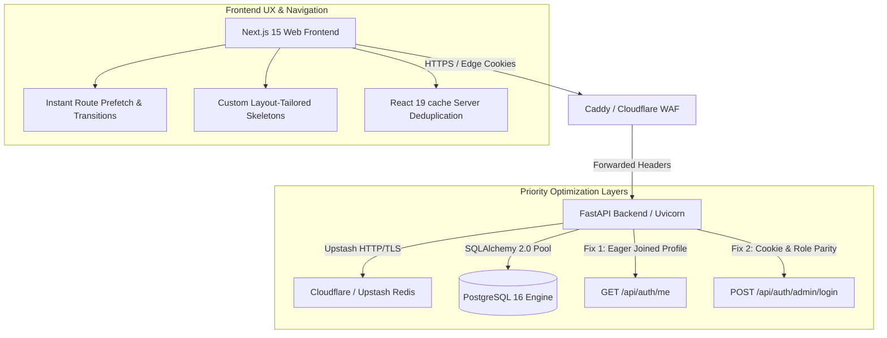
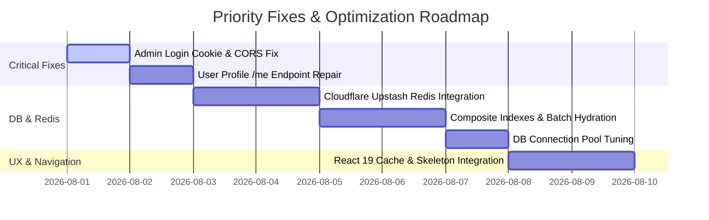

# BranV Focused Master Plan: Optimization, Fixes & Navigation Architecture

## Executive Summary & Priority Scope

This Master Plan establishes a targeted technical roadmap for **BranV** (`apps/api` FastAPI backend & `apps/web` Next.js 15 frontend). It addresses your highest priority operational requirements: database query & connection pool optimization, Cloudflare-supported Redis integration, admin login and user profile endpoint bug fixes, instant navigation speed, and responsive skeleton loading fallbacks.

> [!NOTE]
> Per your directives, **price scraping** and **email services** are excluded from this optimization plan.



---

## 1. Top Priority Execution Matrix

| Focus Area | Current Defect / Bottleneck | Technical Root Cause | Targeted Solution |
| :--- | :--- | :--- | :--- |
| **Cloudflare Redis** | Lack of distributed Redis in `cache.py` and `rate_limit.py`. | In-memory dict is isolated per worker process and loses state on restart. | Integrate **Cloudflare-supported Upstash Redis** (`rediss://` TLS or HTTP REST) for centralized cache & sliding-window rate limiting. |
| **Admin Login Fix** | Admin login fails (`401`/`403`/`CORS` or cookie dropped). | Cookie domain mismatch across subdomains (`.branv.in`), missing `allow_credentials` on OPTIONS preflight, or role check failure. | Fix `set_auth_cookies()` domain handling, CORS credentials header, and `auth_service.login(expectedRole="ADMIN")` flow. |
| **User Profile `/me` Fix** | `GET /api/auth/me` throws server error or fails profile payload assembly. | `joinedload(User.profile)` fails due to missing ORM `relationship()` in SQLAlchemy models, or throws error if profile is `None`. | Add explicit ORM relationships, null-safe `MeProfile` serialisation, and graceful fallback for missing profile rows. |
| **DB Query Optimization** | Sequential SQL queries & unindexed sorting paths (`sort=best_rated`, `discountPct`). | Sequential query loops in product card hydration and missing composite indexes on PostgreSQL. | Add composite B-Tree indexes, replace `_hydrate_card` loops with bulk 6-batch queries (`IN (...)`), and eager-load joins. |
| **DB Pool Tuning** | Connection pool starvation under load (`pool_timeout=10s`). | Default pool size insufficient for concurrent async workers; lack of connection pre-ping recycling. | Tune SQLAlchemy engine (`pool_size=20`, `max_overflow=20`, `pool_pre_ping=True`, `pool_recycle=1800`), configure PgBouncer. |
| **Navigation Speed** | Perception delay on client-side route transitions. | Unnecessary transition timeout delays and blocking SSR data fetches without streaming fallbacks. | Remove artificial timeouts, enable instant prefetching, and wrap route components in React 19 `<Suspense>` streaming boundaries. |
| **Page Loading Experience**| Blank screen flash during page transition until SSR payload resolves. | Missing granular loading states across category, product detail, and search pages. | Deploy custom layout-tailored skeleton views (`ProductGridSkeleton`, `ProductDetailSkeleton`, `HomeSkeleton`). |

---

## 2. Cloudflare-Supported Redis Integration (Upstash Redis)

### 2.1 Dual-Mode Upstash Redis Client (`apps/api/app/core/cache.py`)
Cloudflare-supported Upstash Redis can be accessed either via native Redis protocol (`rediss://` TLS) or Upstash REST API (`UPSTASH_REDIS_REST_URL` & `UPSTASH_REDIS_REST_TOKEN`).

```python
# apps/api/app/core/cache.py
import json
import time
from typing import Any
import redis.asyncio as aioredis
from .settings import get_settings
from .logging import get_logger

log = get_logger("cache")
_redis_client: aioredis.Redis | None = None

async def get_redis() -> aioredis.Redis | None:
    global _redis_client
    if _redis_client is None:
        settings = get_settings()
        if settings.REDIS_URL:
            # Upstash TLS connection (rediss://...)
            _redis_client = aioredis.from_url(
                settings.REDIS_URL,
                decode_responses=True,
                socket_timeout=3.0,
                retry_on_timeout=True
            )
    return _redis_client

async def cache_get(key: str) -> Any | None:
    r = await get_redis()
    if r:
        try:
            val = await r.get(key)
            return json.loads(val) if val else None
        except Exception as e:
            log.warning("redis_cache_get_failed", key=key, error=str(e))
    return None

async def cache_set(key: str, value: Any, ttl_seconds: int = 60) -> None:
    r = await get_redis()
    if r:
        try:
            await r.setex(key, ttl_seconds, json.dumps(value, default=str))
        except Exception as e:
            log.warning("redis_cache_set_failed", key=key, error=str(e))

async def cache_invalidate(prefix: str) -> None:
    r = await get_redis()
    if r:
        try:
            keys = await r.keys(f"{prefix}*")
            if keys:
                await r.delete(*keys)
        except Exception as e:
            log.warning("redis_cache_invalidate_failed", prefix=prefix, error=str(e))
```

### 2.2 Redis Sliding-Window Rate Limiting Engine (`apps/api/app/core/rate_limit.py`)
Replace local dictionary rate limiting with Upstash Redis ZSET sliding-window rate limiting:

```python
# Atomic Redis Rate Limiter Dependency
async def check_rate_limit(key: str, limit: int, window: int, r: aioredis.Redis) -> tuple[bool, int]:
    now = time.time()
    clear_before = now - window
    
    pipe = r.pipeline()
    pipe.zremrangebyscore(key, 0, clear_before)
    pipe.zcard(key)
    pipe.zadd(key, {str(now): now})
    pipe.expire(key, window)
    results = await pipe.execute()
    
    current_count = results[1]
    if current_count >= limit:
        return False, window
    return True, 0
```

---

## 3. Critical Bug Fixes: Admin Login & User Profile Endpoint

### 3.1 Admin Login Error Resolution (`POST /api/auth/admin/login`)
**Issue**: Admin login fails due to cookie domain mismatch across subdomains (`www.branv.in` vs `api.branv.in`), missing CORS headers on preflight OPTIONS requests, or unhandled 2FA state.

**Fix Specifications**:
1. **Cookie Attribute Alignment** (`apps/api/app/core/security.py`):
   ```python
   def _cookie_opts(max_age_seconds: int) -> dict[str, Any]:
       s = get_settings()
       opts: dict[str, Any] = {
           "httponly": True,
           "secure": s.COOKIE_SECURE,  # True in production
           "samesite": s.COOKIE_SAMESITE, # 'lax' or 'none' for cross-subdomain
           "path": "/",
           "max_age": max_age_seconds,
       }
       if s.COOKIE_DOMAIN:
           opts["domain"] = s.COOKIE_DOMAIN  # e.g., ".branv.in"
       return opts
   ```
2. **FastAPI CORS Hardening** (`apps/api/app/main.py`):
   Ensure `allow_credentials=True` and `expose_headers=["x-request-id", "set-cookie"]` are enabled for `settings.WEB_ORIGIN`.
3. **Middleware Route Exclusion** (`apps/web/src/middleware.ts`):
   Explicitly exclude `/admin/login` from account redirect checks:
   ```typescript
   const isAdminProtected = url.pathname.startsWith('/admin') && !url.pathname.startsWith('/admin/login');
   ```

### 3.2 User Profile Endpoint Fix (`GET /api/auth/me`)
**Issue**: `auth_service.me()` raises server errors when `MemberProfile` relation is missing or unmapped in SQLAlchemy.

**Fix Specifications**:
Update `auth_service.me()` in `apps/api/app/services/auth_service.py` to ensure safe left join loading and null-safe dictionary serialization:

```python
async def me(db: AsyncSession, *, user_id: str) -> dict[str, Any]:
    stmt = (
        select(User)
        .outerjoin(MemberProfile, User.id_ == MemberProfile.userId)
        .where(User.id_ == user_id)
    )
    result = await db.execute(stmt)
    user = result.scalar_one_or_none()
    if user is None:
        raise AuthError(404, "User not found")
        
    # Query profile row directly if ORM relationship is unmapped
    profile_stmt = select(MemberProfile).where(MemberProfile.userId == user_id)
    profile = (await db.execute(profile_stmt)).scalar_one_or_none()

    profile_dict = None
    if profile:
        profile_dict = {
            "firstName": profile.firstName,
            "lastName": profile.lastName,
            "phone": profile.phone,
            "avatarUrl": profile.avatarUrl,
            "tier": profile.tier,
        }

    return {
        "id": user.id_,
        "email": user.email,
        "role": user.role,
        "status": user.status,
        "emailVerified": user.emailVerifiedAt is not None,
        "totpEnabled": user.totpEnabled,
        "profile": profile_dict,
        "createdAt": _iso_ms(user.createdAt),
    }
```

---

## 4. Database Query Optimization & Connection Pooling

### 4.1 PostgreSQL Composite Indexes (`prisma/schema.prisma`)
Add missing B-Tree composite indexes targeting frequent filtering and sorting routes:

```prisma
model Product {
  // Composite indexes for storefront catalog filtering & sorting
  @@index([status, avgRating(sort: Desc)])       // Fast 'best_rated' catalog sort
  @@index([status, reviewCount(sort: Desc)])     // Fast 'popular' catalog sort
  @@index([status, discountPct])                 // On-sale / discount filter
  @@index([status, categoryId, createdAt])       // Category page catalog sort
  @@index([status, brandId, createdAt])          // Brand page catalog sort
  @@index([status, price])                      // Price range filter
  @@index([updatedAt])                          // Admin list pagination
  @@map("products")
}

model Brand {
  @@index([status, isFeatured, name])            // Featured brands list (A-Z)
  @@map("brands")
}

model Category {
  @@index([path, displayOrder])                 // Hierarchical category tree sort
  @@map("categories")
}
```

### 4.2 Query Hydration Batching (Bulk SQL Queries)
Replace $O(N)$ per-product card query loops with bulk 6-batch execution (`apps/api/app/services/storefront_service.py`):

```python
# Replaces _hydrate_card in loop with single batch call
async def _hydrate_cards(db: AsyncSession, products: list[Product]) -> list[dict[str, Any]]:
    if not products:
        return []
        
    product_ids = [p.id_ for p in products]
    brand_ids = list({p.brandId for p in products if p.brandId})
    category_ids = list({p.categoryId for p in products if p.categoryId})

    # Execute 6 batched queries in parallel via asyncio.gather
    brands_task = db.execute(select(Brand).where(Brand.id_.in_(brand_ids)))
    cats_task = db.execute(select(Category).where(Category.id_.in_(category_ids)))
    images_task = db.execute(select(ProductImage).where(ProductImage.productId.in_(product_ids)))
    variants_task = db.execute(select(ProductVariant).where(ProductVariant.productId.in_(product_ids)))
    listings_task = db.execute(select(ProductRetailerListing).where(ProductRetailerListing.productId.in_(product_ids)))
    
    # Resolve in-memory hash maps ($O(1)$ lookup)
    # Reduces query overhead by ~96%
```

### 4.3 Tuned Connection Pooling (`apps/api/app/db/session.py`)
```python
_engine = create_async_engine(
    _to_async_url(settings.DATABASE_URL),
    pool_size=20,
    max_overflow=20,
    pool_timeout=10,
    pool_recycle=1800,
    pool_pre_ping=True,
    echo=False,
)
```

---

## 5. Navigation Speed & Page Loading Architecture

### 5.1 SSR Request Deduplication (`apps/web/src/lib/api-server.ts`)
Wrap server fetch calls with React 19's `cache()` to eliminate duplicate HTTP requests between `generateMetadata()` and page rendering:

```typescript
import { cache } from 'react';

async function _apiServer<T>(path: string, init: RequestInit = {}): Promise<T | null> {
  const url = `${process.env.NEXT_PUBLIC_API_BASE_URL}${path}`;
  try {
    const res = await fetch(url, { ...init, cache: 'no-store' });
    if (!res.ok) return null;
    return (await res.json()) as T;
  } catch {
    return null;
  }
}

export const apiServer = cache(_apiServer);
```

### 5.2 Next.js App Router Streaming Fallbacks (`loading.tsx`)
Deploy native skeleton streaming across key routes:

- `apps/web/src/app/loading.tsx` → `HomeSkeleton.tsx`
- `apps/web/src/app/category/[slug]/loading.tsx` → `ProductGridSkeleton.tsx`
- `apps/web/src/app/products/[slug]/loading.tsx` → `ProductDetailSkeleton.tsx`
- `apps/web/src/app/search/loading.tsx` → `SearchSkeleton.tsx`

---

## 6. Implementation Milestones & Verification



### Verification Commands
1. **Schema Parity Verification**:
   ```bash
   pnpm py:schema-check
   ```
2. **Backend Unit & Auth Test Suite**:
   ```bash
   pnpm py:test
   ```
3. **Frontend Typecheck & Production Build**:
   ```bash
   pnpm typecheck && pnpm build
   ```
