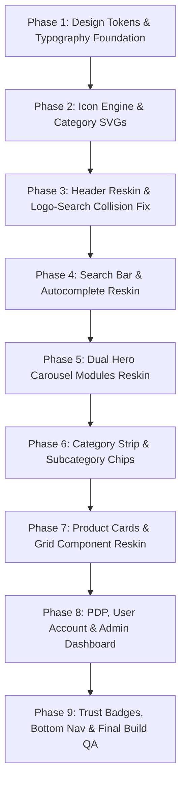

# BranV Master UI Migration Blueprint & Sequential Execution Plan
**Author**: Senior Frontend Architect & UI/UX Specialist (30+ Years Experience)  
**Target Codebase**: `apps/web` (Next.js 14, Tailwind CSS, Framer Motion)  
**Reference Prototypes**: `prototype/desktop/` (16:9 Widescreen) & `prototype/mobile/` (9:16 Portrait)  
**Scope Contract**: 100% Visual UI Theme Migration. Zero backend, schema, business logic, component prop, or API contract modifications. 100% Data & Category Preservation.

---

## 1. Executive Summary & Collision Resolution Strategy

This Master Plan establishes a **sequential, step-by-step roadmap** to migrate `apps/web` to match `prototype/desktop/` and `prototype/mobile/` while explicitly resolving all layout collision bugs in the current website.

### Critical UI Collision Fixes Built Into Plan:
1. **Brand Logo vs. Search Bar Collision (Mobile)**:
   - *Current Bug*: In `StorefrontShell.tsx`, `SearchBox` sits inline inside the top flex header row, squishing and overlapping directly with the `BranV` brand logo text on mobile screens (<480px).
   - *Resolution*: Split mobile header into two distinct, non-overlapping block rows (as designed in `prototype/index.html`):
     - **Top Header Row**: Hamburger menu (left), Centered Logo `BranV ALL FOR MEN` (center), Wishlist & Cart count badges (right).
     - **Dedicated Search Row**: Full-width 48px rounded search pill with right circular blue action button (`#0055FF`) sitting cleanly below the top header.
2. **Mobile Bottom Navigation Overlay Collision**:
   - *Current Bug*: Content at the bottom of pages gets trapped behind the fixed 64px bottom nav bar due to missing page bottom padding.
   - *Resolution*: Enforce global `padding-bottom: 74px` (`pb-20`) across all mobile storefront pages in `StorefrontShell.tsx`.
3. **Product Card Badge vs. Wishlist Heart Collision**:
   - *Current Bug*: On narrow 2-column mobile product cards, top-left badges (`-55%`, `Featured`) can collide with top-right wishlist buttons.
   - *Resolution*: Enforce vertical stacking for top-left badges with `max-w-[calc(100%-44px)]` width limits, keeping the top-right wishlist button floating inside a dedicated 32px glassmorphic circle.
4. **Z-Index Layer Collisions**:
   - *Resolution*: Enforce unified z-index scale:
     - `z-10`: Floating card heart & AI badges
     - `z-30`: Sticky Header & Fixed Bottom Nav
     - `z-40`: Search Autocomplete Dropdown
     - `z-50`: Slide-in Drawers, Quick Add, and Mobile Filter Bottom Sheet

---

## 2. Sequential Step-by-Step Implementation Roadmap

To avoid any component breakage or overlapping issues during migration, implementation will proceed in strict order:

---

### Phase 1: Design Tokens & Typography Foundation
* **Target Files**: `apps/web/src/styles/design-tokens.css`, `tailwind.config.ts`, `apps/web/src/app/layout.tsx`.
* **Actions**:
  1. Replace primary color scale with Electric Blue `#0055FF` (`0 85 255`), hover `#0044CC`, light background `#EFF6FF`.
  2. Set canvas background to `#F8FAFC`, card surfaces to `#FFFFFF`, card borders to `#F1F5F9`.
  3. Load **Plus Jakarta Sans** for display headings and **Inter** for body/UI text in `layout.tsx`.

---

### Phase 2: Icon Engine & Category SVG System
* **Target Files**: `apps/web/src/components/icons.tsx`, `apps/web/src/components/category-icons/`.
* **Actions**:
  1. Centralize general UI icons using `lucide-react` with `strokeWidth={1.75}`, `size={24}`, and Tailwind `currentColor`.
  2. Build custom SVG React components for apparel categories (Shirts, Polos, T-Shirts, Jeans, Tracks, Footwear, Watches) in `@/components/category-icons/`.

---

### Phase 3: Header Reskin & Logo-Search Collision Fix
* **Target Files**: `apps/web/src/components/StorefrontShell.tsx`.
* **Actions**:
  1. Update Logo component: `Bran` (Navy `#0F172A`) + `V` (Electric Blue `#0055FF`) + Subtitle `ALL FOR MEN` (9px bold uppercase, 2px letter spacing).
  2. **Fix Collision**: Separate Mobile Top Header into two block rows. Top row houses Hamburger menu, centered `BranV ALL FOR MEN` logo, and 17px red/blue notification count badges.
  3. Reskin Desktop Header with horizontal navigation links (`New Arrivals`, `Shirts`, `T-Shirts`, `Jeans`, `Jackets`, `Accessories`).

---

### Phase 4: Search Bar & Autocomplete Reskin
* **Target Files**: `apps/web/src/components/SearchBox.tsx`.
* **Actions**:
  1. Reskin input to 48px height, `rounded-full` pill with `1px solid #E2E8F0` border.
  2. Add left search icon (`#94A3B8`) and right 38px circular action button in Electric Blue (`#0055FF`).
  3. Apply `z-40` to autocomplete results dropdown to prevent z-index bleed.

---

### Phase 5: Dual Hero Carousel Modules Reskin
* **Target Files**: `apps/web/src/components/HeroCarouselDesktop.tsx`, `apps/web/src/components/HeroCarouselMobile.tsx`.
* **Actions**:
  1. **Desktop Hero (`HeroCarouselDesktop.tsx`)**: Reskin horizontal landscape hero with dark navy gradient overlay (`#031B4E` → `#0044B4` → `#0066FF`), cyan title highlight (`#38BDF8`), white pill CTA button (`Shop Now ↗`), and active pagination dots.
  2. **Mobile Hero (`HeroCarouselMobile.tsx`)**: Reskin vertical 9:16 portrait hero banner with prototype gradient overlay and white pill CTA, preserving vertical full-screen mobile height.

---

### Phase 6: Category Strip & Subcategory Chips
* **Target Files**: `apps/web/src/components/CategoryShowcase.tsx`, `apps/web/src/components/SubcategoryChips.tsx`.
* **Actions**:
  1. Replace category letter circles with 62px circular icon containers using custom SVG category components.
  2. Style active category item with `#EFF6FF` background, `1.5px solid #0055FF` border, and `#0055FF` text.
  3. Style subcategory chips (`Half Sleeves`, `Full Sleeves`, `Checks`, `Printed`, `Formals`).

---

### Phase 7: Product Cards & Grid Component Reskin
* **Target Files**: `apps/web/src/components/ProductCard.tsx`.
* **Actions**:
  1. Enforce **4:5 aspect ratio** (`aspect-[4/5]`) on product image boxes.
  2. Floating wishlist heart button: Top-right 32px glassmorphic circle (`rgba(255,255,255,0.9)`, `backdrop-filter: blur(4px)`), red filled heart (`#EF4444`).
  3. **Fix Collision**: Stack top-left discount/featured badges vertically with `max-w-[calc(100%-44px)]`.
  4. Style pricing in 16px extra-bold Plus Jakarta Sans in `#0055FF`.
  5. Outbound affiliate redirection buttons (`Buy on Myntra ↗`, `Buy on Amazon ↗`).

---

### Phase 8: PDP, User Account, Admin Dashboard & Bottom Nav
* **Target Files**: `app/products/[slug]/page.tsx`, `app/account/page.tsx`, `app/admin/page.tsx`, `MobileBottomNav.tsx`, `TrustBadges.tsx`.
* **Actions**:
  1. **PDP**: Reskin product gallery with `AI-rendered` badge, price comparison table (`Where to Buy`), and affiliate disclosure.
  2. **User Account**: Reskin profile header card (`VP` avatar, Vineel Kumar Polavarapu, email, member date, unverified badge, sign out) and 4 action cards (`Wishlist`, `My Wardrobe`, `Notifications`, `Preferences`).
  3. **Admin Console**: Reskin `/admin` dashboard with light theme, blue primary accents, and active link management.
  4. **Trust Badges**: Light blue background block (`#F0F7FF`), 40px white icon circles.
  5. **Sticky Bottom Nav**: 64px fixed bar with active top blue indicator line (`width: 36px`, `height: 3px`, `#0055FF`).

---

### Phase 9: Visual Audit & Production Compilation Gate
* **Actions**:
  1. Run `pnpm --filter @branv/web build` and `typecheck`.
  2. Conduct visual verification on 375px, 768px, and 1440px viewports to ensure zero collisions.

---

## 3. Data & Category Parity Guarantee

This plan strictly preserves:
- All 6 main categories (`Shirts`, `T-Shirts`, `Jeans`, `Tracks`, `Footwear`, `Watches`) and subcategories (`Half Sleeves`, `Full Sleeves`, etc.).
- All filter controls (`PRICE` range, `DISCOUNT` pills, `BRAND` checkboxes, `RETAILER` checkboxes, status toggles).
- All user account features (`VP` profile avatar, saved wishlist, wardrobe, notifications, preferences, support).
- Pure affiliate redirection model (outbound retailer CTA links, no cart/payment changes).

---
*Stored in repository as `UI_THEME_MIGRATION_REPORT.md`.*
